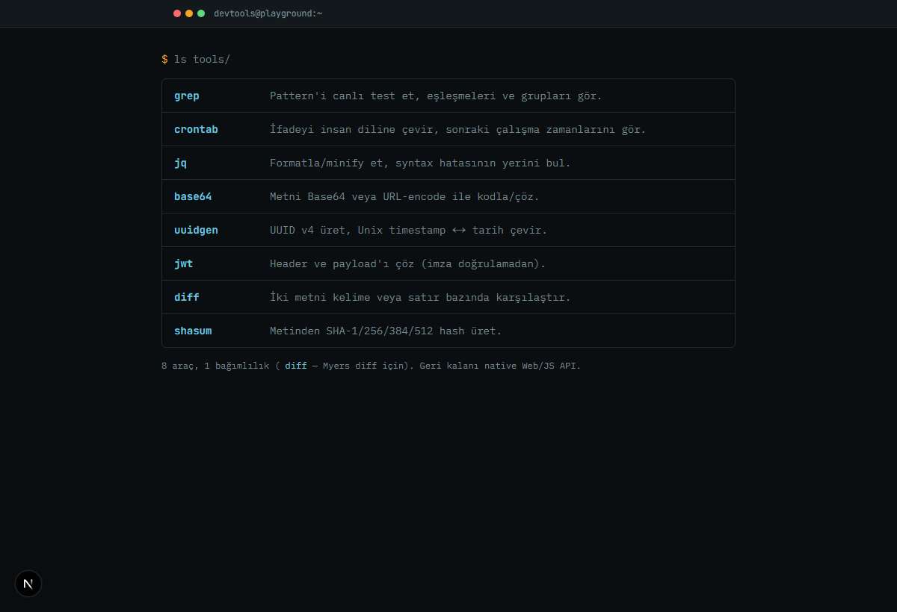
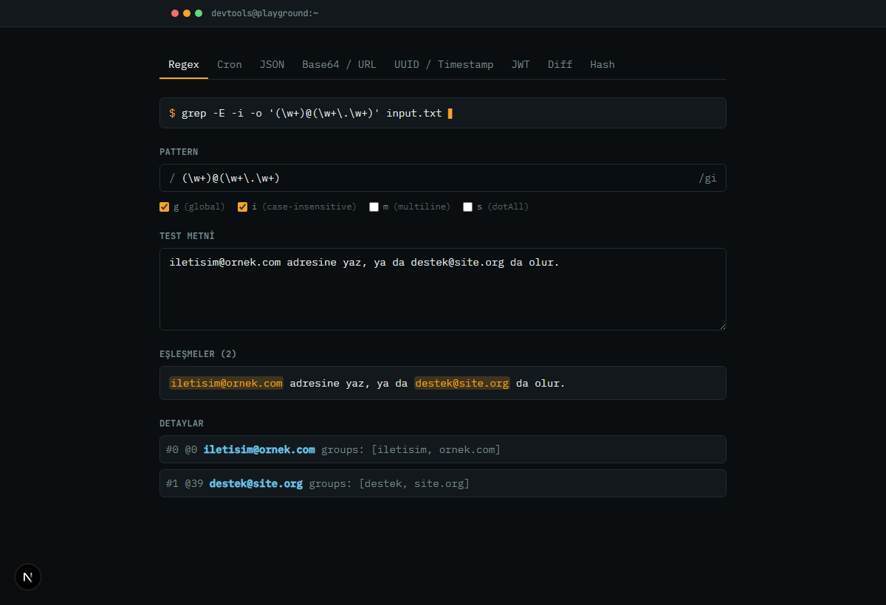
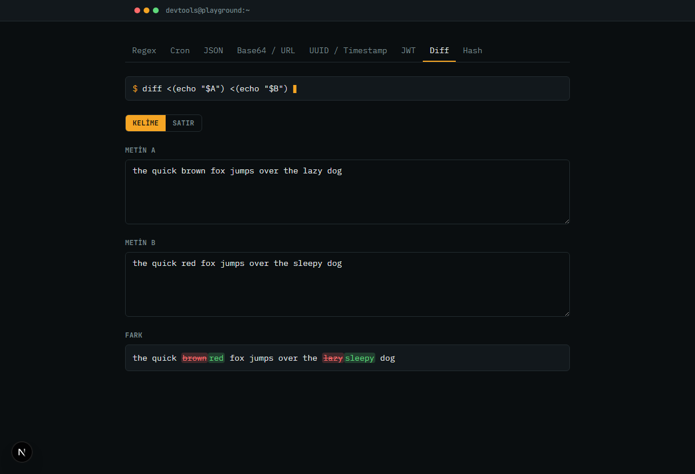

# Devtools Playground

Regex, cron, JSON, Base64/URL, UUID/timestamp, JWT, diff ve hash için
tek sayfalı, terminal temalı bir geliştirici araç kutusu. Var olan
native Web/JS API'leri ve olgun kütüphaneleri ince bir katmanla
birleştirir — tek gerçek bağımlılık [`diff`](https://www.npmjs.com/package/diff)
(Myers diff algoritması için), geri kalanı `JSON`, `crypto`,
`TextEncoder`/`TextDecoder`, `Intl` gibi platform API'leri.

Her araç sayfası, o an girdiğiniz veriye göre canlı güncellenen
gerçek bir shell komutu gösterir (`grep`, `jq`, `base64`, `uuidgen`,
`date`, `shasum`, `diff`) — arayüz, aracın arkasındaki gerçek
Unix komutuna bilinçli olarak gönderme yapıyor.





## Araçlar

| Komut | Sayfa | Ne yapar |
| --- | --- | --- |
| `grep` | `/regex` | Pattern'i canlı test et, eşleşmeleri ve grupları gör |
| `crontab` | `/cron` | Cron ifadesini insan diline çevir, sonraki çalışma zamanlarını gör |
| `jq` | `/json` | JSON'u formatla/minify et, syntax hatasının yerini bul |
| `base64` | `/base64` | Metni Base64 veya URL-encode ile kodla/çöz |
| `uuidgen` | `/id` | UUID v4 üret, Unix timestamp ↔ tarih çevir |
| `jwt` | `/jwt` | Header ve payload'ı çöz (imza doğrulamadan) |
| `diff` | `/diff` | İki metni kelime veya satır bazında karşılaştır |
| `shasum` | `/hash` | Metinden SHA-1/256/384/512 hash üret |

## Geliştirme

```bash
npm install
npm run dev      # http://localhost:3000
npm test         # lib/ altındaki saf fonksiyon testleri
npm run build    # prod build
npm run lint
```

Her aracın mantığı `lib/*-utils.ts` içinde UI'dan bağımsız, saf
fonksiyonlar olarak yaşıyor ve `lib/lib.test.ts`'de (framework'süz,
Node'un native TypeScript desteğiyle) test ediliyor.

## Stack

Next.js 16 (App Router) · Tailwind CSS v4 · TypeScript · `cron-parser`
· `cronstrue` · `diff`
